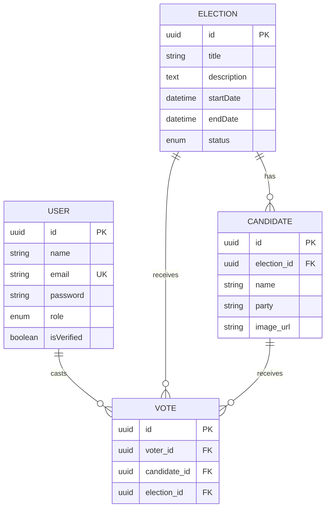

# VotePulse - Comprehensive Project Report

## Abstract
The landscape of democratic participation is undergoing a massive shift towards digital transformation. **VotePulse** is a secure, efficient, and highly scalable digital platform designed to modernize the traditional election process. It provides voters with the unprecedented convenience of casting their ballots from anywhere in the world, overcoming geographical boundaries, mobility limitations, and significantly reducing the massive logistical costs associated with physical polling stations. At its core, VotePulse ensures data integrity and security through robust authentication mechanisms, strict role-based access control (RBAC), and encrypted data storage. By bridging the gap between technology and civic duty, this project aims to foster higher voter turnout, eliminate human error in vote tallying, and build unwavering trust in the electoral process.

## Chapter 1: Introduction
Democracy fundamentally relies on the active, unhindered participation of its citizens, and voting is the primary mechanism of this participation. However, traditional paper-based or localized electronic voting machines often present significant barriers to entry for remote voters, individuals with disabilities, and the elderly. Furthermore, organizing physical elections requires massive logistical planning, financial expenditure, and human resources.

This project introduces **VotePulse**, a modern, full-stack web application that digitizes the entire election workflow from end to end. Whether it is a university student council election, a corporate board decision, or a municipal voting event, VotePulse offers a seamless, secure experience. From user registration and automated email verification to election management, candidate allocation, and real-time result tallying, VotePulse provides an intuitive digital election environment that prioritizes both security and the user experience.

## Chapter 2: Problem Statement
The conventional, physical voting system faces a multitude of critical challenges that limit its effectiveness and reach:

1.  **Accessibility Barriers:** Voters must be physically present at specific locations within designated timeframes. This poses a severe challenge for the elderly, individuals with physical disabilities, and those living or working abroad (expatriates).
2.  **Massive Logistical Overhead:** Organizing physical elections requires immense manpower. Expenses include printing paper ballots, renting venues, hiring security personnel, and transporting ballot boxes securely.
3.  **Inefficiency and Time Consumption:** Standing in long queues discourages voter turnout. Furthermore, the manual counting of paper ballots is extremely slow and delays the announcement of results.
4.  **Security Risks and Tampering:** Centralized physical boxes and paper ballots are susceptible to damage, loss, ballot stuffing, and human error during the counting process.
5.  **Lack of Transparency:** Voters have no way to verify that their vote was recorded accurately without compromising the secret ballot principle.

There is a pressing need for a decentralized, secure, and easily accessible digital voting solution that addresses these pain points.

## Chapter 3: Goals/Objectives & Key Learnings

### Goals & Objectives
*   **Uncompromising Security:** Implement robust user authentication, mandatory email verification for identity confirmation, and secure password hashing to protect user accounts.
*   **Transparency & Accuracy:** Ensure that votes are accurately recorded in the database, immutable once cast, and that election results are tallied and displayed in real-time without manual intervention.
*   **Intuitive Usability:** Provide a highly responsive, modern, and intuitive user interface (UI) for both voters (to effortlessly cast their votes) and administrators (to efficiently manage complex elections).
*   **Strict Role-Based Access Control (RBAC):** Clearly differentiate functionalities, ensuring that system administrators have full control over election management, while standard voters are restricted to viewing and participating in active elections.

### Key Learnings
*   **Modern Authentication:** Deep understanding of implementing stateless, token-based authentication using JSON Web Tokens (JWT) and secure password management using Bcrypt.
*   **Database Design:** Handling complex relational data structures, foreign keys, and cascading deletes using an Object-Relational Mapper (Sequelize) with a MySQL database.
*   **Frontend Architecture:** Building dynamic, responsive Single Page Applications (SPAs) using React 19, managing complex application state, and utilizing utility-first CSS frameworks like Tailwind CSS combined with Material-UI components.
*   **Third-Party Integrations:** Successfully integrating external APIs and services, such as Cloudinary for seamless image uploads (candidate profiles) and Nodemailer with SMTP servers for reliable transactional email delivery.

## Chapter 4: Functional & Non-Functional Requirements

### Functional Requirements
The core functional features necessary for the system to operate correctly and serve its users.

| Req ID | Feature | Description | Access Level |
| :--- | :--- | :--- | :--- |
| **FR-01** | User Registration | Users can sign up providing their name, email, and password. | Guest |
| **FR-02** | Email Verification | The system sends a verification code/link to the registered email to confirm identity before allowing login. | Guest / User |
| **FR-03** | User Login | Secure authentication returning a JWT session token. | User |
| **FR-04** | Role-based Dashboard | Displays specific options based on whether the user is an 'admin' or 'voter'. | Voter, Admin |
| **FR-05** | Election Management | Add, modify, or close electoral events (title, start/end dates). | Admin |
| **FR-06** | Candidate Management | Add candidates to elections, upload their profile pictures, and assign parties. | Admin |
| **FR-07** | View Active Elections | Users can browse ongoing elections and view the list of participating candidates. | Voter |
| **FR-08** | Cast Vote | Users can securely cast a single, immutable vote per active election. | Voter |
| **FR-09** | Result Tallying | System automatically aggregates votes and declares real-time tallies/winners. | Voter, Admin |
| **FR-10** | Manage Users | Administrators can view all registered users and their verification statuses. | Admin |

### Non-Functional Requirements
The system attributes that dictate how the system performs, scales, and protects data.

| Req ID | Attribute | Description |
| :--- | :--- | :--- |
| **NFR-01** | Security (Auth) | Passwords must be hashed using Bcrypt (salt rounds >= 10). Endpoints must use JWT authorization headers. |
| **NFR-02** | Security (Integrity) | Database constraints must strictly prevent duplicate votes from the same user ID in a single election. |
| **NFR-03** | Performance | API endpoints (except heavy image uploads) should respond in < 200ms. |
| **NFR-04** | Scalability | Architecture must handle a high volume of concurrent POST requests during peak voting hours. |
| **NFR-05** | Responsiveness | The UI must adapt seamlessly across mobile phones, tablets, and desktop displays (Mobile-First Design). |
| **NFR-06** | Reliability | The system should aim for 99.9% uptime during active election periods. |

## Chapter 5: High-Level Design (HLD)
VotePulse follows a robust, modern Client-Server architecture designed for separation of concerns.

```mermaid
graph TD
    Client["📱 Client Application<br/>(React / Vite SPA)"]
    API["⚙️ API Gateway & Backend<br/>(Node.js / Express)"]
    DB[("🗄️ Database<br/>(MySQL)") ]
    CDN["☁️ Cloudinary CDN<br/>(Image Hosting)"]
    SMTP["📧 Nodemailer SMTP<br/>(Email Services)"]

    Client <-->|REST API via HTTPS| API
    API <-->|Sequelize ORM| DB
    API -->|Upload Candidate Images| CDN
    API -->|Send Verification OTPs| SMTP
```

1.  **Client Application (Frontend):** A Single Page Application (SPA) built with React and Vite. It serves as the presentation layer, handling user interactions, form validations, and routing.
2.  **API Gateway/Backend Server:** A Node.js and Express.js server that acts as the central brain. It processes complex business logic, handles secure authentication flows, and serves as the bridge between the client and the persistent storage layer.
3.  **Database Server:** A MySQL relational database providing persistent, structured storage with strict ACID properties.
4.  **External Cloud Services:** Cloudinary (for storing profile images) and Nodemailer (for sending transactional emails).

## Chapter 6: Low-Level Design (LLD)
The relational database schema is heavily normalized to prevent data redundancy and ensure integrity. 



*Critical Constraint:* A unique composite index on `(voter_id, election_id)` guarantees that a User can cast only one Vote per Election at the database level.

## Chapter 7: Advantages & Disadvantages

### Advantages
*   **Unparalleled Accessibility:** VotePulse democratizes the voting process by allowing users to participate from their homes, workplaces, or while traveling.
*   **Massive Cost Reduction:** By eliminating the need for physical polling stations, paper ballots, transportation, and manual counting staff.
*   **Speed and Accuracy:** Vote tallying is instantaneous, completely eliminating human error in counting.
*   **Environmentally Friendly:** The system supports green initiatives by offering a 100% paperless process.

### Disadvantages
*   **The Digital Divide:** Excludes individuals who lack access to smart devices or reliable internet.
*   **Cybersecurity Threats:** Susceptible to DDoS attacks or database breaches if security protocols fail.
*   **Infrastructure Dependency:** The election process relies heavily on server uptime and network stability.

## Chapter 8: System Design and Architecture
VotePulse is built upon a strict **Three-Tier Architecture**:

1.  **Presentation Tier (Frontend):** Developed using React 19 and Vite. Utilizes Tailwind CSS for rapid layout creation and Material-UI for accessible components. React Router DOM handles client-side routing.
2.  **Application Tier (Backend):** Developed using Node.js and Express.js. Implements a modular pattern separating routes, controllers, and models. Middleware handles JWT verification, role checking, and multipart form parsing (Multer).
3.  **Data Tier (Database):** Managed by MySQL and Sequelize ORM to abstract SQL queries and prevent SQL injection attacks.

## Chapter 9: Tech Stack & Implementation Details

### Frontend Technologies
*   **Core Library:** React 19
*   **Build Tool:** Vite 
*   **Styling:** Tailwind CSS & Material-UI
*   **Iconography:** Lucide-React
*   **Routing:** React Router DOM v7

### Backend Technologies
*   **Environment & Framework:** Node.js, Express.js
*   **Database & ORM:** MySQL, Sequelize
*   **Authentication:** jsonwebtoken (JWT), bcrypt
*   **Utilities:** multer (file uploads), cloudinary (CDN storage), nodemailer (SMTP emails).

## Chapter 10: API Design and Input/Output Structures
The following details the primary RESTful API endpoints, mapping out the expected request payloads and response structures.

| Endpoint | Method | Purpose | Input Payload (Request Body) | Output Structure (Response) |
| :--- | :--- | :--- | :--- | :--- |
| `/api/users/register` | `POST` | Registers a new user account. | `{ "name": "John Doe", "email": "j@test.com", "password": "pass" }` | `{ "success": true, "message": "Verification email sent." }` |
| `/api/users/login` | `POST` | Authenticates a user and provides a session token. | `{ "email": "j@test.com", "password": "pass" }` | `{ "success": true, "token": "eyJhb...", "user": { "id": "...", "role": "voter" } }` |
| `/api/elections` | `POST` | Creates a new election event (Admin only). | `{ "title": "Council 2026", "startDate": "...", "endDate": "..." }` | `{ "success": true, "election": { "id": "...", "title": "..." } }` |
| `/api/candidates` | `POST` | Registers a candidate with an image upload. | `FormData`: `name`, `party`, `election_id`, `image` (File) | `{ "success": true, "candidate": { "id": "...", "image_url": "https://..." } }` |
| `/api/votes/cast` | `POST` | Records a voter's selection securely. | `{ "electionId": "...", "candidateId": "..." }` | `{ "success": true, "message": "Vote successfully recorded." }` |
| `/api/results/:electionId` | `GET` | Fetches real-time vote aggregations. | *None (Params: `electionId`)* | `{ "success": true, "results": [ { "candidate": "...", "voteCount": 142 } ] }` |

## Chapter 11: Features & User Journey Results

### The Voter Journey
1.  **Registration & Verification:** A new user signs up. The backend encrypts their password and generates a unique verification token sent via Nodemailer. The user clicks the link, verifying their account.
2.  **Secure Authentication:** The user logs in. The backend issues a JWT, which the frontend stores to authorize subsequent requests.
3.  **Dashboard Access:** The voter lands on their dashboard, viewing active elections tailored to their eligibility.
4.  **Casting a Vote:** The voter navigates to the `CastVote` interface, reviews candidate profiles (images served via Cloudinary), makes their selection, and submits.
5.  **Validation:** The backend intercepts the request, verifies the JWT, checks the database to prevent duplicate voting, and securely records the vote.

### The Administrator Journey
1.  **Election Creation:** An admin accesses the `AddElection` portal to define the parameters of a new electoral event.
2.  **Candidate Registration:** Using the `ManageCandidates` portal, the admin registers participants, uploads their photos, and assigns them to an election.
3.  **User Management:** Admins oversee the user base via `ManageUsers`, monitoring verification statuses.
4.  **Result Monitoring:** Admins instantly view final tallies and declare winners through interactive charts via real-time data aggregations.

## Chapter 12: Conclusion & Future Scope

### Conclusion
**VotePulse** successfully demonstrates how modern web technologies can be seamlessly leveraged to create a highly secure, scalable, and user-friendly platform for digital elections. By completely digitizing the voting process, the project addresses the core inefficiencies of traditional voting. The implementation of robust security measures ensures the integrity of the electoral process remains intact, paving the way for transparent, instantaneous results.

### Future Scope
*   **Blockchain Integration:** Transitioning the voting ledger to a decentralized Blockchain network (using smart contracts) to make the voting record mathematically immutable.
*   **Advanced Biometric Authentication:** Integrating with mobile device hardware (FaceID, Fingerprint Scanners) for a secondary layer of identity verification.
*   **AI-Driven Anomaly Detection:** Implementing machine learning algorithms to instantly flag suspicious activities like sudden spikes in votes from a single IP address.
*   **Comprehensive Localization (i18n):** Adding multi-language support to ensure the platform is accessible to a diverse, global demographic.
